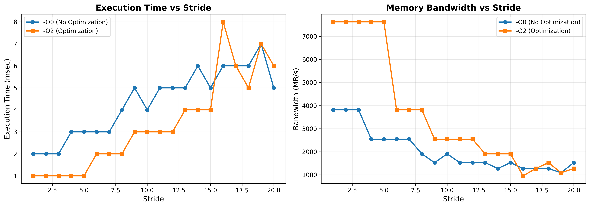
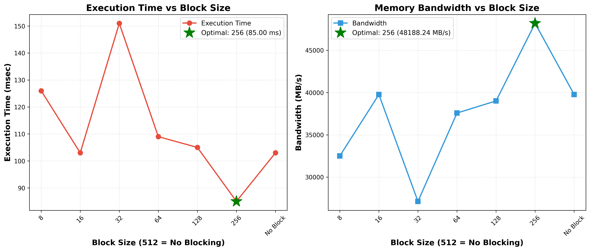

# TP1: Optimizing Memory Access - Lab Report

**Course:** Parallel Computing 
**Student:** Yassine BLALI
**Date:** January 2026  
**Objective:** Analyze and optimize memory access patterns in C programs through cache optimization, loop transformations, and memory profiling.

---

## Exercise 1: Memory Stride Analysis and Compiler Optimization

I implemented a program to study how memory access patterns (stride) affect performance with different compiler optimization levels.

### Implementation

I created [exercice1.c](exercice1.c) that accesses array elements with varying strides (1 to 20). A stride of 1 means consecutive access, while larger strides skip elements, causing cache misses.

```c
for (int i = 0; i < N * i_stride; i += i_stride)
    sum += a[i];
```

### Methodology

I compiled and ran the program with two optimization levels:
- **-O0:** No optimization (baseline)
- **-O2:** Compiler optimizations including loop unrolling

```bash
gcc -O0 exercice1.c -o exercice1_O0.exe
gcc -O2 exercice1.c -o exercice1_O2.exe
```

### Results



**Performance Comparison:**
- Average execution time: -O0 = 4.35ms, -O2 = 3.35ms (**1.30x speedup**)
- Average bandwidth: -O0 = 2,038 MB/s, -O2 = 3,580 MB/s (**75.6% improvement**)

**Key Observations:**
- Performance degrades significantly with increasing stride due to cache line misses
- Compiler optimization (-O2) provides substantial benefits across all strides
- Sequential access (stride 1-3) achieves best performance due to spatial locality

### Analysis

The -O2 optimization achieved better performance through:
- **Loop unrolling:** Fewer loop iterations and branch instructions
- **Better register allocation:** Reduced memory accesses
- **Instruction-level parallelism:** Multiple operations execute simultaneously

---

## Exercise 2: Loop Reordering for Cache Optimization

I implemented matrix multiplication with different loop orderings to demonstrate the impact of memory access patterns on cache performance.

### Implementation

I created [mxm.c](exercice02/mxm.c) with two versions of matrix multiplication (512×512 matrices):

**Standard (i-j-k order):**
```c
for (int i = 0; i < R1; i++)
    for (int j = 0; j < C2; j++)
        for (int k = 0; k < R2; k++)
            result[i][j] += m1[i][k] * m2[k][j];
```

**Optimized (i-k-j order):**
```c
for (int i = 0; i < R1; i++)
    for (int k = 0; k < R2; k++)
        for (int j = 0; j < C2; j++)
            result[i][j] += m1[i][k] * m2[k][j];
```

### Results

| Version | Time (ms) | Bandwidth (MB/s) | Speedup |
|---------|-----------|------------------|---------|
| i-j-k (Standard) | 247.00 | 16,583 | 1.0x |
| i-k-j (Optimized) | 62.00 | 66,065 | **3.98x** |

### Explanation

The **3.98x speedup** comes from changing how we access matrix B:

- **i-j-k:** Accesses `m2[k][j]` column-wise (stride = 512 elements = 4KB jumps) → cache misses
- **i-k-j:** Accesses `m2[k][j]` row-wise (sequential) → cache hits

All three matrices are now accessed sequentially in the innermost loop, maximizing cache line utilization (64 bytes = 8 doubles per cache line).

---

## Exercise 3: Block Matrix Multiplication (Tiling)

I implemented block matrix multiplication to improve cache locality by dividing large matrices into smaller blocks that fit in cache.

### Implementation

I created [mxm_bloc.c](exercice02/mxm_bloc.c) with 6 nested loops (3 for blocks, 3 for elements):

```c
for (int ii = 0; ii < n; ii += block_size) {
    for (int jj = 0; jj < n; jj += block_size) {
        for (int kk = 0; kk < n; kk += block_size) {
            // Work within this block (stays in cache!)
            for (int i = ii; i < min(ii + block_size, n); i++)
                for (int k = kk; k < min(kk + block_size, n); k++)
                    for (int j = jj; j < min(jj + block_size, n); j++)
                        C[i][j] += A[i][k] * B[k][j];
        }
    }
}
```

### Results

I tested block sizes from 8 to 256 on 512×512 matrices:



| Block Size | Time (ms) | Bandwidth (MB/s) | Speedup |
|------------|-----------|------------------|---------|
| 8 | 126.00 | 32,508 | 1.00x |
| 16 | 103.00 | 39,767 | 1.22x |
| 32 | 151.00 | 27,126 | 0.83x |
| 64 | 109.00 | 37,578 | 1.16x |
| 128 | 105.00 | 39,010 | 1.20x |
| **256** | **85.00** | **48,188** | **1.48x** |
| No blocking | 103.00 | 39,767 | 1.00x |

**Optimal block size: 256** achieved 17.5% speedup over no blocking.

### Analysis

**Why block size 256 is optimal:**
- Working set = 3 × 256² × 8 bytes = 1.5 MB (fits in L3 cache)
- Balances cache efficiency with loop overhead
- Block size 32 (fits in L1) performed worse due to excessive outer loop iterations

---

## Exercise 4: Memory Management and Debugging with Valgrind

I analyzed and fixed memory leaks in a C program using Valgrind's Memcheck tool.

### Initial Problem

The program [memory_debug.c](exercice04/memory_debug.c) allocated two arrays but failed to free them:

```c
void free_memory(int *arr) {
    // Empty function - memory leak!
}

int main() {
    int *array = allocate_array(SIZE);
    int *array_copy = duplicate_array(array, SIZE);
    free_memory(array);
    return 0;  // array_copy never freed!
}
```

### Valgrind Detection (Before Fix)

I ran Valgrind using Docker:

```bash
docker run --rm -v ${PWD}:/workspace -w /workspace ubuntu:latest bash -c \
"apt-get update && apt-get install -y gcc valgrind && \
gcc -g -o memory_debug memory_debug.c && \
valgrind --leak-check=full ./memory_debug"
```

**Results:**
```
HEAP SUMMARY:
    in use at exit: 40 bytes in 2 blocks
    total heap usage: 3 allocs, 1 frees

LEAK SUMMARY:
    definitely lost: 40 bytes in 2 blocks
ERROR SUMMARY: 2 errors
```

Valgrind identified both leaks with exact line numbers:
- Leak 1: `array` allocated at line 48 (20 bytes)
- Leak 2: `array_copy` allocated at line 51 (20 bytes)

### Solution

I implemented two fixes:

```c
void free_memory(int *arr) {
    if (arr) {
        free(arr);
    }
}

int main() {
    // ... program logic ...
    free_memory(array);
    free_memory(array_copy);  // Added this line
    return 0;
}
```

### Valgrind Verification (After Fix)

```
HEAP SUMMARY:
    in use at exit: 0 bytes in 0 blocks
    total heap usage: 3 allocs, 3 frees

All heap blocks were freed -- no leaks are possible
ERROR SUMMARY: 0 errors
```

✅ All memory leaks eliminated. Every `malloc()` now has a matching `free()`.


---

## Exercise 5: HPL Benchmark (Theoretical Analysis)

This exercise involves running the High-Performance Linpack (HPL) benchmark on HPC infrastructure, which requires cluster access (Toubkal Supercomputer) unavailable for the moment.

---

## References

- [Exercise 1 Code](exercice1/)
- [Exercise 2 Coden](exercice02/mxm.c)
- [Exercise 3 Code](exercice02/mxm_bloc.c)
- [Exercise 4 Code](exercice04/)
- Valgrind Documentation: https://valgrind.org/docs/manual/
